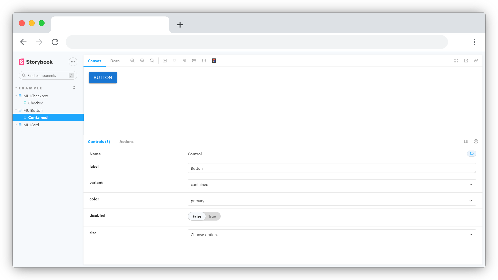

<div align="center">

  
  <br/>
  <br/>


</div>

<hr/>

## Storybook Anima addon

[Storybook](https://github.com/storybooks/storybook) addon that extracts the Storybook data and transforms stories into Figma components for a better design-development workflow.

  

## Links

Add links here

## Requirements

-   Storybook@>=6.0.0
-   Anima Account 

This addon should work with any framework. If you find a case that the addon does not work, please open an issue.

## Getting started

### 1. Install

```sh
npm install --save-dev storybook-anima
# yarn add -D storybook-anima
```

### 2. Register the addon in `main.js`

```js
// .storybook/main.js
module.exports = {
    addons: ["storybook-anima"],
};
```
### 3. Set Anima access token

You can set the access token as an environment variable called `STORYBOOK_ANIMA_TOKEN`.
You can create `.env` file in your project's root folder, or you can provide the environment variable as a command line parameter when building or dynamically running Storybook.


```shell
# .env
STORYBOOK_ANIMA_TOKEN="eyJhbGciOiJIUzI1N.."
```

## Development

Run following commands in separate tabs to start development

```shell
npm run build
npm run dev
```

For more information visit : [Anima Storybook integration](https://animaapp.com)

## License

MIT © [Moez Bouaggad](https://animaapp.com)